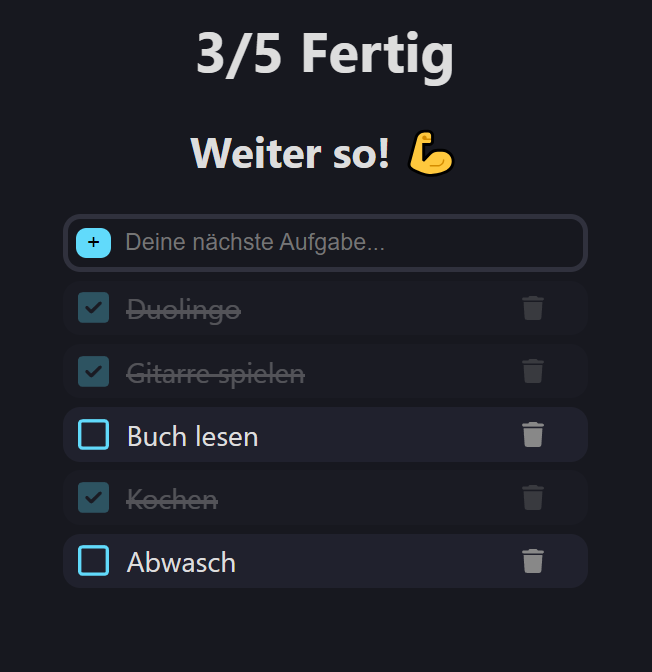

# todo-app
Click here to use the application: https://deyirao.github.io/todo-app/

### Application Information
* Built using the framework `React`.
* It uses the local storage as database.
* The UI is written in german.
* It is a simple and minimalistic program.

### Features
* Clicking on checkboxes has animations.
* Tasks can be deleted by clicking the trashbin.
* If no tasks are finished, the text says 'Do your best! 😉'
* If some, but not all tasks are finished, it says 'Keep going! 💪'
* If all tasks are finished, the text says 'End of work!! 🍻'

<h3 align="left">Used programming languages</h3>

### Preview

